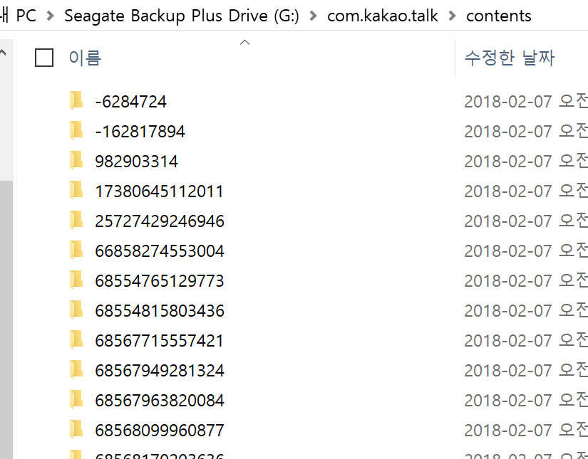
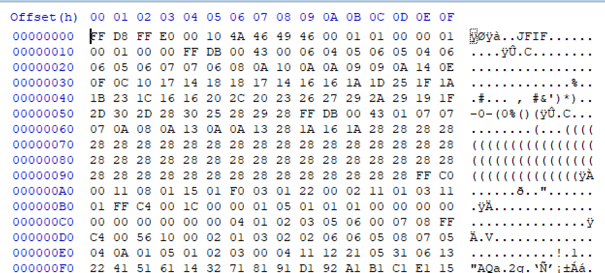
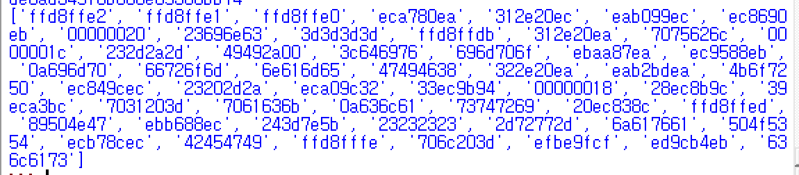
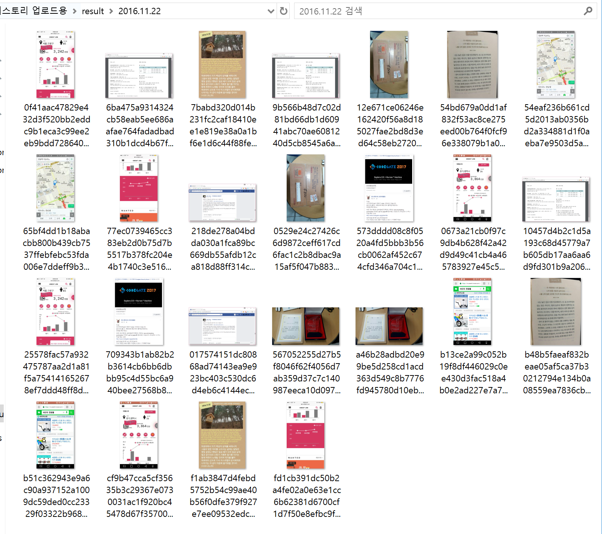

# Recovering KakaoTalk Expired Files
> 카카오톡 임시파일 복구 프로그램

카카오톡 임시파일을 복구합니다.

## 사용방법
[**블로그에서 확인**](https://bperhaps.tistory.com/entry/%EC%B9%B4%EC%B9%B4%EC%98%A4%ED%86%A1-%EC%A0%80%EC%9E%A5%EA%B8%B0%EA%B0%84-%EB%A7%8C%EB%A3%8C-%ED%8C%8C%EC%9D%BC-%EB%B3%B5%EA%B5%AC-%ED%94%84%EB%A1%9C%EA%B7%B8%EB%9E%A8)

	* [**dcyang**](https://github.com/dcyang) 님이 python-magic 5.19 버전 이후 버전을 이용한 python script 를 업데이트 해 주셨습니다. [**[바로가기]**](https://gist.github.com/dcyang/7f857b5cc1a3c6d7f0ebc92a06dafd5d)
	
## 개발 과정

카카오톡으로 사진들을 주고받다 보면 저장기간이 만료되서 사진을 다운로드 하지 못하는 경우가 있다.

하지만 잘 보면, 다운로드는 불가능하지만 흐릿하게 해당 사진을 볼 수 있는것을 확인할 수 있다.
여기서 저 사진을 가져올 수 있으면 저장 기간을 놓쳐 다운받지 못한 사진도 받을 수 있지 않을까? 하는 의문을 품게 되었다.

먼저 카카오톡의 사진들의 위치를 알아내야 했고, 경로를 찾아 내었다.

카카오톡 Media파일 저장 위치:
```sh
/Android/data/com.kakao.talk
```
해당 경로를 들어가면 다음과 같은 폴더들을 볼 수 있다.

우리가 사용할 폴더는 contents 폴더이다. 대화방에서 주고받은 사진들의 정보들은 저 폴더안에 다 들어있다고 보면 된다.
해당 파일을 컴퓨터도 이동시킨 후 안의 내용물을 보면 ???? 가 나올 수 밖에 없다.


사진3. Contents 폴더의 내부

파일과 폴더들의 이름들이 해쉬화 되어있는것을 볼 수 있으며 심지어 파일들은 확장자도 존재하지 않는다.
처음에는 파일들이 암호화돼 있나? 하는 끔찍한 상상을 하였지만 다행이 그것은 아니었다.

그림3. HXD를 이용해 확인한 파일 형식

HXD를 이용해 파일들을 열어보니 파일 시그니처가 해당 파일이 무엇인지를 정확하게 명시해 주고 있었다.
필요한 정보는 모두 얻었다. 코딩만 하면 된다. 파이썬을 이용하여 코딩할 것인데, 파일 시그니처를 이용해 파일들의 확장자를 붙여줄 것이다.
원래는 사진, 동영상 정도의 파일만 있을 것이라 생각하여 라이브러리를 안쓰고 직접 시그니처들을 리스트에 넣어 비교할 예정이었으나 본인의 데이터(약 1년 6개월)를 분석한 결과

사진4. 파일들의 앞 4바이트 리스트

사진뿐만 아니라 다른 잡다한 파일의 시그니처도 확인되는걸 볼 수 있었다.
물론, 사진 동영상의 시그니처만 처리하고 나머지는 예외처리시켜버리면 라이브러리를 쓰지 않고도 충분히 가능하긴 하지만.. 그건 성격상 안맞기도 하고 (귀찮..) 그냥 라이브러리를 사용하기로 했다.
사용한 라이브러리는 python-magic이다. 

```sh
# -*- coding: cp949 -*-
 
import sys
import os
import time
import shutil
import magic

 
# Referenced from "https://wikidocs.net/39"
def search(dirname):
    filenames = os.listdir(dirname)
    for filename in filenames:
        full_filename = os.path.join(dirname, filename)
        if os.path.isdir(full_filename):
            search(full_filename)
        else:
            path = time.strftime("%Y.%m.%d" , time.localtime(os.path.getmtime(full_filename)))
            extention = magic.from_file(full_filename, mime=True).split("/")[1]
            
            if not os.path.exists("./result/" + path):
                os.mkdir("./result/" + path)
 
            shutil.copy(full_filename, "./result/" + path + "/" + filename + "." + extention)     
 
if not os.path.exists("result"):
    os.mkdir("result");
 
search("/mnt/g/com.kakao.talk/contents")
```
간단하게 작성한 코드이다. 결과를 보자


사진5. 결과

실행시켰을 경우 결과는 다음과 같고, 다운로드 기간이 지난 사진이라도 가져올 수 있는 것을 볼 수 있다.

위 과정을 통하여 복구코드를 작성할 수 있었으며, 이것을 바탕으로 java 프로그램으로 재 빌드 하였다.